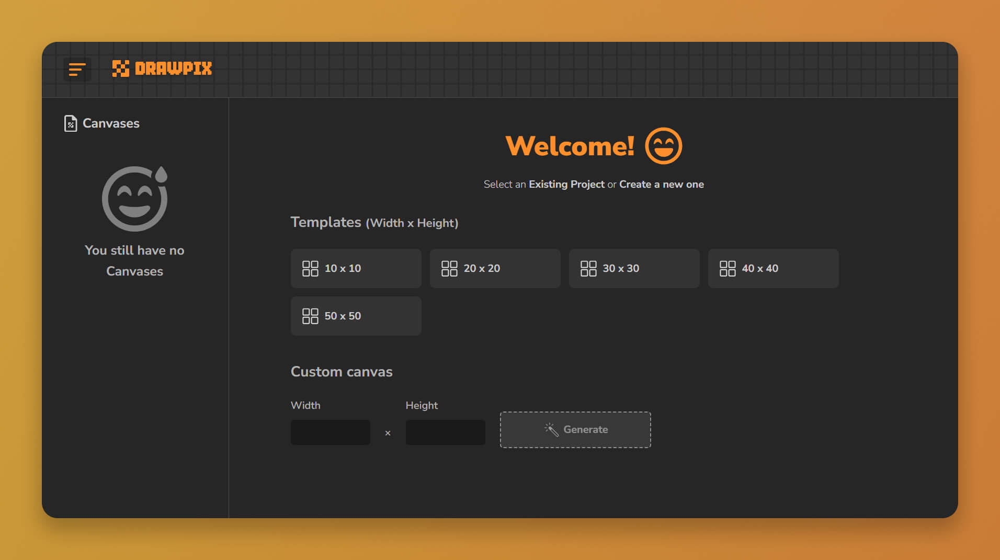
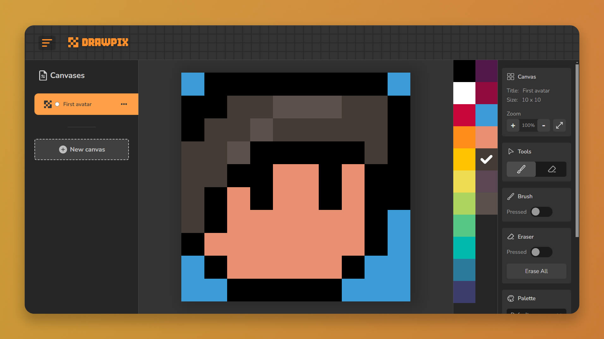
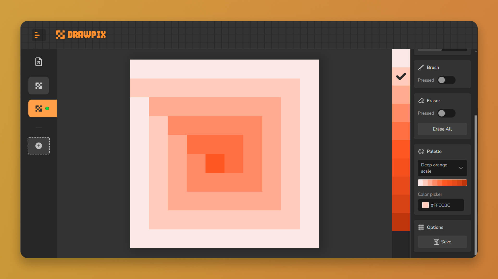
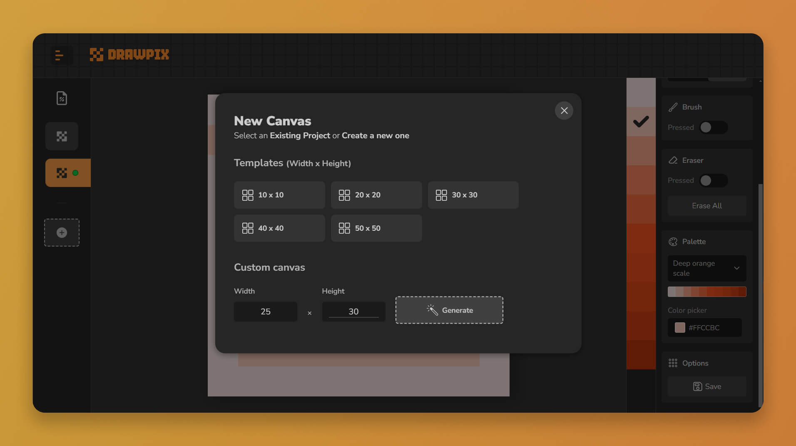

# 🎨 Minimalistic Pixel Art Editor | DrawPix


**Drawpix** is a minimalist editor webapp for Pixel Art.

It has a simple to use interface, allows you to create different pixel art designs and save them in the browser.

## 🛠️ Tech Stack

This project is purely made with HTML, CSS and JavaScript.

## 📌 Features

- Data persistence: designs are stored using local storage of the browser.

## 🕹 Demo

This project is hosted and published on the web using the **Github Pages** hosting service.

👉 Visit this [link](https://fr4nkd3v.github.io/drawpix/) to see it in action.

## 📷 Screenshots






## 📥 Installation

Clone the project and install dependencies:

```bash
  git clone https://github.com/fr4nkd3v/drawpix.git
  cd DrawPix
  npm install
```

## 🚀 Run Locally

After installation start the local server:

```bash
  npm run start
```

For development start with:

```bash
  npm run dev
```

## 🧐 Lessons Learned

In this project I wanted to challenge myself to create a medium complexity web application using only **HTML, CSS and JavaScript**.

In addition, I wanted to implement a **structure of folders and files** that can be separated based on their responsibility and provide greater scalability to the project.

The project is organized as follows:

```bash
/
├── app/
│   └── main.js
│   └── assets/
│   └── constants/
│   └── utils/
│   └── entities/
│       └── canvas.js
│   └── presentation/
│       └── ui.js
│       └── components/
│       └── controllers/
│   └── repositories/
│       └── local-storage-canvas.js
│       └── local-storage-custom-canvas-template.js
│   └── use-cases/
│       └── get-canvas.js
│       └── create-canvas.js
│       └── update-canvas.js
│       └── delete-canvas.js
│       └── ...
├── index.html
└── package.json
```

Structure Details:

- `app/main.js` -> File that loads all the javascript processes on the web.
- `app/assets/` -> Store css files, images, icons & logos.
- `app/constants/` -> Store constant values of project.
- `app/utils/` -> Store utility functions
- `app/entities/` -> For the main project entities
- `app/presentation/` -> It refers to the concept of presentation elements of the project, here we will have the main components and the controllers
  - `components/` -> These are the most important visual components of the project, such as the toolbar, the layout bar, the pixel editor, etc.
  - `controllers/` -> Are responsible for linking the components with the entities and use cases
  - `ui.js` -> Here all the unique elements existing in the project will be referenced, such as buttons, inputs, panels, containers, etc.
- `app/repositories/` -> They are in charge of defining the data persistence methods, such as local storage for this case.
- `app/use-cases/` -> They define the different use cases supported by our application using the repositories to perform each case.

I also learned how to provide a **better coexistence of different functionalities that are intertwined with each other and could collide** in the operation of the application.

For example, the functionality of using the brush and eraser tool together with the functionality of keeping them pressed, or the functionality of fitting the design to its parent container so that it covers as much as possible, thus giving rise to the various zoom actions.

## 👂 Feedback

If you have any comments or feedback, you can write to me at <frank.code31@gmail.com>.

## 🤝 Contributing

Contributions are always welcome!

You can do this by creating a new branch from the `dev` branch, push your new branch and open a pull request from your branch to the `dev` branch.

## ☕ Support

For support, send email at <frank.code31@gmail.com>.
